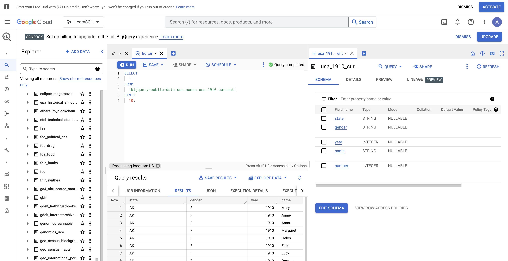

# SQL lessons at [Northeastern](https://www.nulondon.ac.uk/) Skills Bootcamp

This is a repository with notes on how to learn SQL using [BigQuery](https://console.cloud.google.com/bigquery)

## The setup



## The queries to try

```sql
SELECT
  *
FROM
  `bigquery-public-data.usa_names.usa_1910_current`
LIMIT
  10;
 ```

```sql
SELECT
  MIN(date) AS min_date,
  MAX(date) AS max_date
FROM
  `bigquery-public-data.covid19_weathersource_com.county_day_history`;
  ```
